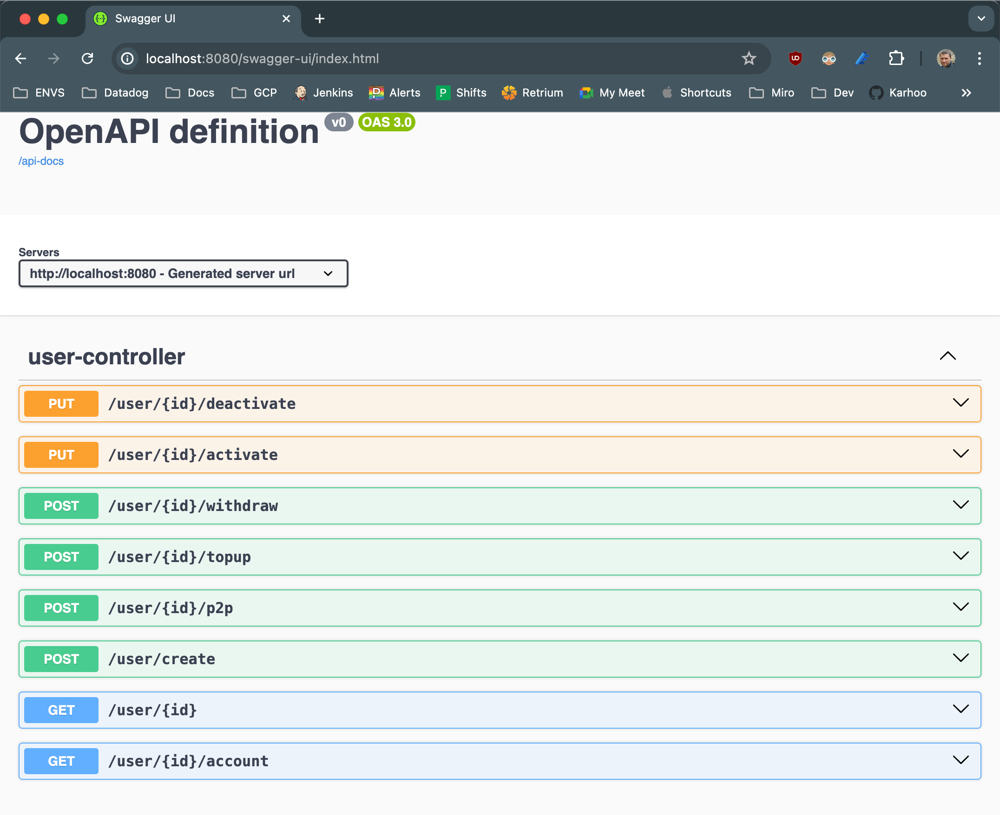

# Teya Assessment

## Task description
This task should take around 1-2 hours to complete.


You are expected to write a web application that simulates a tiny bank.


From a functional perspective, the following features should be implemented:
- Creation and deactivation of users
- Ability for users to deposit/withdraw money from their accounts Ability for users to transfer money to another user's account View account balances
- View transaction history


From a technical perspective:
- We expect you to deliver a functional web application that can be run locally.
- You can use any programming language and framework of your choice but we would prefer if you use Java or Go.
- The application should use in memory storage, and it should not be necessary to install any database software to run it.a
- To keep it simple, you can assume that requests have been previously authorized so you do not need to implement any type of authentication or authorization mechanism.

You are free to make assumptions whenever you feel it is necessary, but please document them.

Please try to keep it simple. 

The objective is to understand your approach to problems and your thought process, even if it means having to make trade-offs, rather than a test of your technical knowledge.

The solution should be submitted as a link to a public git repository (GitHub, GitLab, Bitbucket, etc.) with a README file containing instructions on how to run the application as well as a few examples of how to execute the implemented features.

## How to
It's expected that the JDK 17+ is installed on the machine before. 

There is many ways to install java. One of possible ways to get the installation is https://www.oracle.com/uk/java/technologies/downloads/#java17 

### Assemble
To assemble the project you should run 
```text
./mvnw clean install 
```

### Run
To run the application you should invoke from the project's folder
```text
java -jar target/teya-0.0.1-SNAPSHOT.jar
```

## Swagger Documentation
There is Swagger Documentation which is available by http://localhost:8080/swagger-ui/index.html when the application is up and running 


